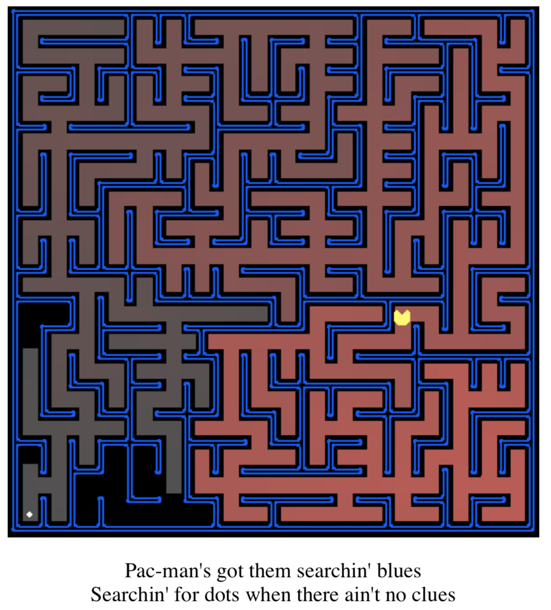
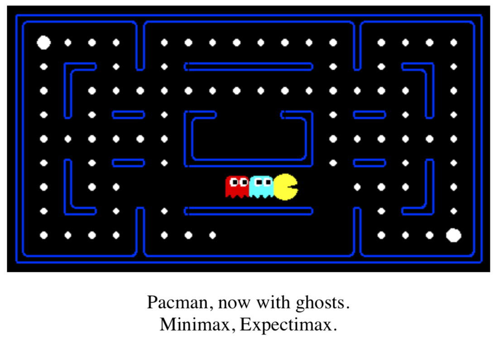
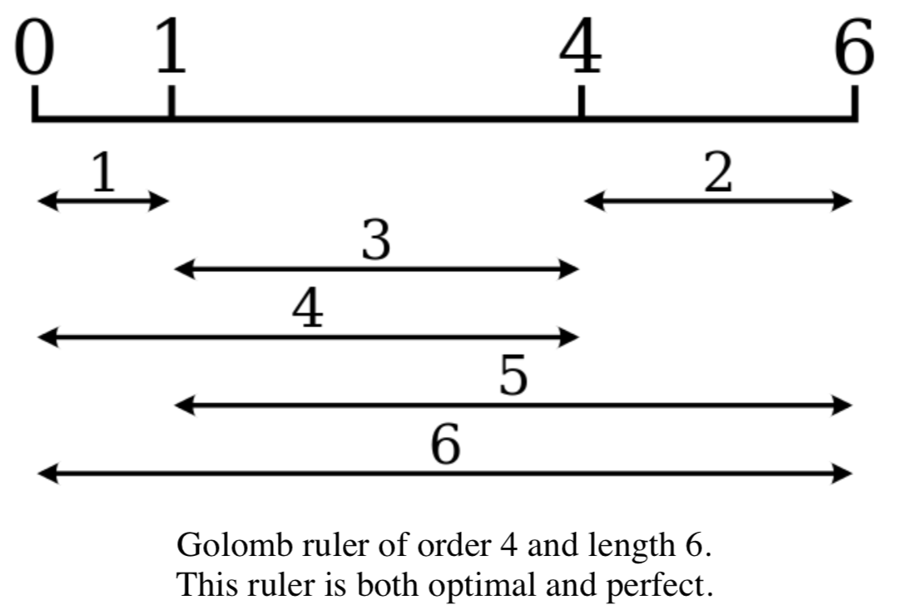

# Artificial-Intelligence

Course webpage : http://www3.cs.stonybrook.edu/~cse537/

Refer to the respective README files for in depth Problem statement :

* Homework 1 - Searching Pac-Man

In this project, your Pac-Man agent will find paths through its maze world, both to reach a particular location and to collect food efficiently. You will build general search algorithms and apply them to Pac-Man scenarios.

* Homweork 2 - Multi-Agent Pac-Man

In this project, you will design agents for the classic version of Pacman, including ghosts. Along the way, you will implement both minimax and expectimax search.

* Homework 3 - Golomb Ruler

A Golomb Ruler of order M and length L consists of M marks placed at unit intervals (i.e. integer positions) along an imaginary ruler such that the differences in spacing between every pair of marks are all distinct, i.e. no two pairs of marks are the same distance apart. The number of marks on the ruler is its order, and the largest distance between two of its marks is its length.

